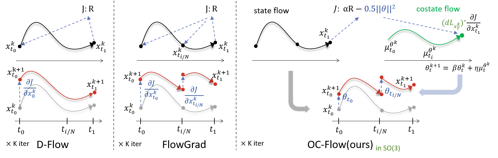

# Training Free Optimal Control Flow (OC-FLOW)

By Luran Wang, Feb 21st, 2025

This is the official repo for the ICLR 2025 paper *Training Free Optimal Control Flow* by Luran Wang, Chaoran Cheng, Yizhen Liao, Yanru Qu, Ge liu. The paper is available at [arXiv](https://arxiv.org/abs/2410.18070).

<p align="center">
  
</p>

## Introduction
We introduce *OC-Flow* as a general and theoretically grounded framework for guided flow matching. By formulating gradient guidance within the optimal control framework, we present the first training-free approach with proven convergence in both Euclidean and SO(3) spaces. OC-Flow demonstrates superior performance in extensive experiments on text-guided image manipulation, conditional molecule generation, and peptide backbone design. Check out our paper for more details!

## Reference
If you find this repo useful, please consider citing our paper:
```bibtex
@article{wang2024training,
  title={Training Free Guided Flow Matching with Optimal Control},
  author={Wang, Luran and Cheng, Chaoran and Liao, Yizhen and Qu, Yanru and Liu, Ge},
  journal={arXiv preprint arXiv:2410.18070},
  year={2024}
}
