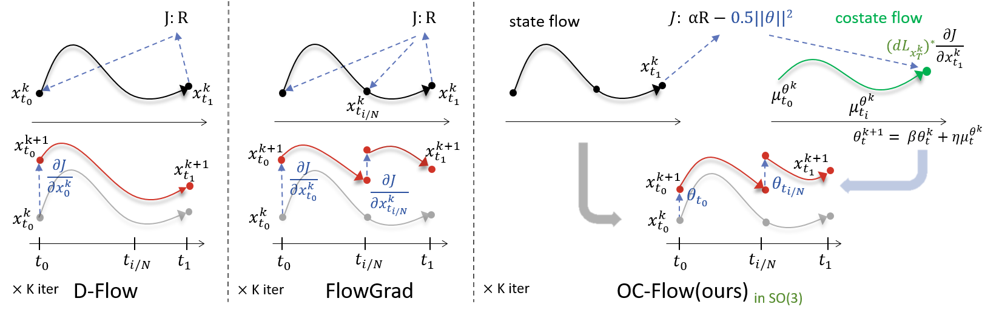

# Training Free Optimal Control Flow (OC-FLOW)


This is the official repo for the ICLR 2025 paper *Training Free Optimal Control Flow* by Luran Wang, Chaoran Cheng, Yizhen Liao, Yanru Qu, Ge liu. The paper is available at [arXiv](https://arxiv.org/abs/2410.18070).

<p align="center">
  
</p>

## Introduction
We introduce *OC-Flow* as a general and theoretically grounded framework for guided flow matching. By formulating gradient guidance within the optimal control framework, we present the first training-free approach with proven convergence in both Euclidean and SO(3) spaces. OC-Flow demonstrates superior performance in extensive experiments on text-guided image manipulation, conditional molecule generation, and peptide backbone design. Check out our paper for more details!

## Requirements

To apply OC-Flow to control the output of pre-trained Rectified Flow model on CelebA-HQ or QM9, run the following code:

```bash
./image/build_env.sh
```

To install the required dependencies for peptide design, create a Conda environment using the provided `environment.yml` file and ' requirements.txt' file after navigating to the `peptide` directory:

```bash
conda env create -f environment.yml
```
```bash
pip install -r requirements.txt
```


## Datasets

- **Celeba-HQ-1024**  
  The **Celeba-HQ-1024** dataset is a high-quality version of CelebA, containing **30,000 images** at **1024×1024** resolution.  
  The full dataset can be downloaded from [Kaggle Celeba-HQ Dataset](https://www.kaggle.com/datasets/lamsimon/celebahq).

- **QM9**  
  The **QM9** dataset consists of **133,885 small molecules** composed of **C, H, O, N, and F**.  
  The QM9 electron density dataset was built by **Jørgensen et al.** ([Paper](https://www.nature.com/articles/s41524-022-00863-y)) and is publicly available via [Figshare](https://data.dtu.dk/articles/dataset/QM9_Charge_Densities_and_Energies_Calculated_with_VASP/16794500).

  Each tarball needs to be extracted, but the inner **lz4 compression** should be retained.  
  Code is provided for reading the compressed **lz4** files.

- **Peptide Design**  
  The data for **peptide design** tasks are available in [PepFlow](https://github.com/Ced3-han/PepFlowww) or [here](https://drive.google.com/drive/folders/1bHaKDF3uCDPtfsihjZs0zmjwF6UU1uVl?usp=sharing). 

Stay tuned for updates, and feel free to reach out for collaboration or discussions!

## Usage
Our implementation is designed to be flexible and easy to use. As demonstrated above, you can easily incorporate OC-Flow into your own project using the framework. 
### iamge

The pre-trained generative model can be downloaded from [Rectified Flow CelebA-HQ](https://drive.google.com/file/d/1ryhuJGz75S35GEdWDLiq4XFrsbwPdHnF/view?usp=sharing) 
Just put it in ``` ./ ```

A **sample image** (`./image/demo/celeba.jpg`) is provided for testing the pre-trained Rectified Flow model on CelebA-HQ.

To modify the **text guidance** or the **pretrained model**, update the relevant parameters in [`./image/main_data.py`](./image/main_data.py).

The **terminal reward function** can be modified in the `flowgrad_edit_batch` function located in [`./image/utils/run_lib_flowgrad_oc.py`](./image/utils/run_lib_flowgrad_oc.py). By default, the loss function is a combination of CLIP loss and LPIPS loss.

Navigate to the `image` directory and run the following command to generate results:

```sh
python main_data.py
```

### QM9

The pretrained model can be downloaded from [EquiFM](https://github.com/AlgoMole/MolFM)

To modify the **pretrained model** or change the **guidance classifier**, update the relevant parameters in [`molecule/main_guided.py`](molecule/main_guided.py).

Navigate to the `molecule` directory and run the following command to generate results:

```bash
python main_guided.py --prop alpha --method oc --gamma 0.01 --lr 1 --max-step 5 --max-iter 5 --save-path oc_alpha.pt
```


### Peptide Design

Our pretrained model, **PepFlow w/Bb**, is designed to exclusively sample peptide backbones while optimizing translations in **Euclidean space** and rotations in **SO(3) space**. The model is available at [PepFlow](https://github.com/Ced3-han/PepFlowww) or [here](https://drive.google.com/drive/folders/1bHaKDF3uCDPtfsihjZs0zmjwF6UU1uVl?usp=sharing). 


To modify the reward guidance, pretrained model, or dataset, update the following:

- **Reward function**: Modify the `Reward` class in line **82** in [`peptide/rlhf_finetune/samples_left.py`](peptide/rlhf_finetune/samples_left.py).
- **Dataset selection**: Change the dataset path in line **37** in [`peptide/models_con/pep_dataloader.py`](peptide/models_con/pep_dataloader.py) together with the config parameter `config.dataset`.
- **Model configuration**: Update the `FlowModel` class in [`peptide/models_con/flow_model.py`](peptide/models_con/flow_model.py) together with the config file `configs/learn_angle.yaml`.

Navigate to the `peptide` directory and run the following command to reproduce the experiments:

```bash
python rlhf_finetune/samples_left.py  --reg_rot 0 --start_data 0 --todo_data 0 --n_tasks 1 --alpha 0.95 --beta 2.0 --algorithm oc_so3_opt --debug
```


## Reference
If you find this repo useful, please consider citing our paper:
```bibtex
@article{wang2024training,
  title={Training Free Guided Flow Matching with Optimal Control},
  author={Wang, Luran and Cheng, Chaoran and Liao, Yizhen and Qu, Yanru and Liu, Ge},
  journal={arXiv preprint arXiv:2410.18070},
  year={2024}
}
